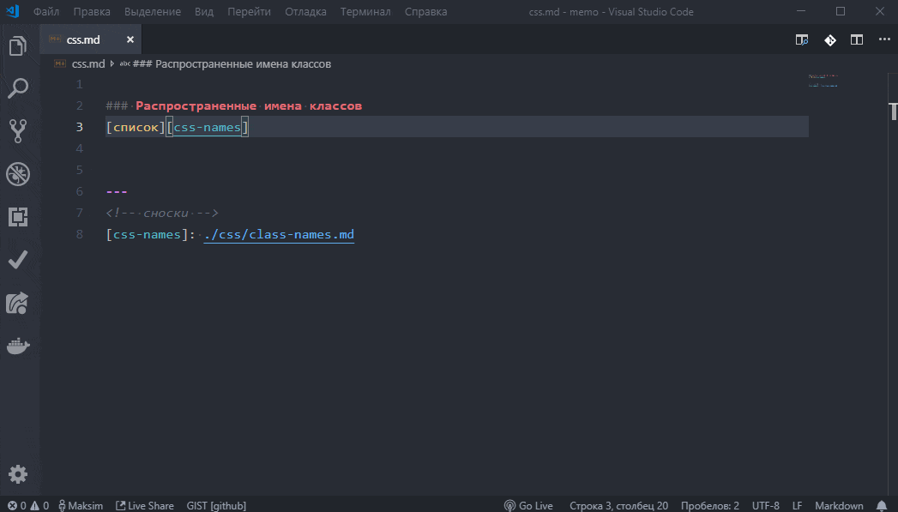

# Vue docs README

## Demo

## en

Viewing documentation [Vue.js, Vuex, Vue Router, Vue SSR, Vuetify, Nuxt.js, VuePress] in the VS Code!

To use, press `F1` then type `Open Vue Docs` then press `Enter`, select the desired item from the drop-down list.

### Settings

+ By default, the VS Code interface language will be selected for the docks. This can be changed in the settings:

    > File -> Preferences -> Settings -> Vue docs configuration ->
    > ` "vueDocs.lang": "ru | en | zh" `

+ It is also possible to add custom links to sites that interest you.  
    > File -> Preferences -> Settings -> Vue docs configuration ->  
    > ` "vueDocs.links": {`  
    > `"Vuetify": "https://vuetifyjs.com/getting-started/quick-start",`  
    > `"Vue CLI": "https://cli.vuejs.org/ru/",`  
    > `},`

+ [repository](https://github.com/Titiaiev/vscode-vue-docs)
+ [bugs](https://github.com/Titiaiev/vscode-vue-docs/issues)

## ru

Просмотр официальной документации [ Vue.js, Vuex, Vue Router, Vue SSR, Vuetify, Nuxt.js, VuePress] во вкладке VS Code!

Для использования нажмите `F1` далее наберите `Open Vue Docs` затем нажмите `Enter`, выберите из выпадающего списка нужный пункт.

### Настройки

+ Поумолчанию, для доков будет выбран язык интерфейса VS Code. Это можно изменить в настройках:

    > Параметры -> Vue docs configuration ->
    > ` "vueDocs.lang": "ru | en | zh" `

+ Также есть возможность добавить пользовательские ссылки на интересующие вас сайты.  
    > Параметры -> Vue docs configuration ->  
    > ` "vueDocs.links": {`  
    > `"Vuetify": "https://vuetifyjs.com/getting-started/quick-start",`  
    > `"Vue CLI": "https://cli.vuejs.org/ru/",`  
    > `},`

+ [репозиторий](https://github.com/Titiaiev/vscode-vue-docs)
+ [баги](https://github.com/Titiaiev/vscode-vue-docs/issues)
